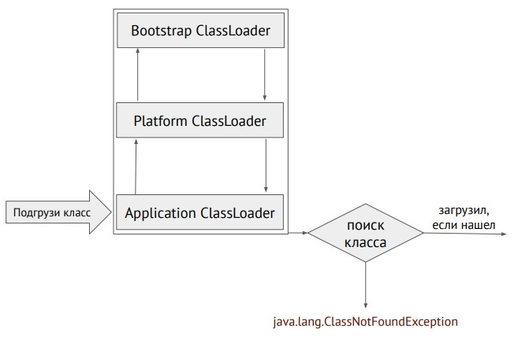
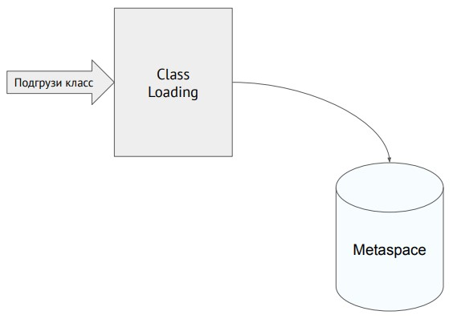

### Задача "Понимание JVM"
___
#### Код для исследования
```
public class JvmComprehension {

    public static void main(String[] args) {
        int i = 1;                      // 1
        Object o = new Object();        // 2
        Integer ii = 2;                 // 3
        printAll(o, i, ii);             // 4
        System.out.println("finished"); // 7
    }

    private static void printAll(Object o, int i, Integer ii) {
        Integer uselessVar = 700;                   // 5
        System.out.println(o.toString() + i + ii);  // 6
    }
}
```
___
#### Описание с точки зрения JVM
Класс JvmComprehension загружаетсяя через ClassLoaders, где класс ищется по очереди на уровнях bootstrap, platform, application.



Когда класс найдем на одном из уровней, происходит его подгрузка и проверка на валидность кода, подготовка примитивов, статических полей и связываение ссылок при их наличии.


Данные об этом классе помещаются для хранения в metaspace.



Периодически сборщик мусора собирает уже не используемые объекты из памяти путем обхода графа достижимых объектов.
При сборке мусора, обычно, приостанавливается работа всей программы.

В стеке создается фрейм для метода main().

Во фрейме main() создается и помещается переменная i со значением 1.

В куче(heap) создается экземплям класса Object, а во фрейме метода main() создается ссылка "o" на него.

В куче(heap) создается экземпляр класса Integer со значением 2, а во фрейме метода main() создается ссылка "ii" на него.

В стеке создается фрейм printAll(), в который помещается i = 1, а так же ссылки на экземпляры o и ii.

Строка "finished" помещается в кучу.
Создается новый фрейм для метода println(), в него помещается строка.
После извлечения строки из фрейма, фрейм метода main() удаляется из стека.

В куче(heap) создается экземпляр класса Integer со значением 700, а во фрейме метода printAll() создается ссылка "uselessVar" на него.

Результат выражения (o.toString() + i + ii) помещается в кучу.
Создается новый фрейм для метода println() и в него помещается результат выражения.